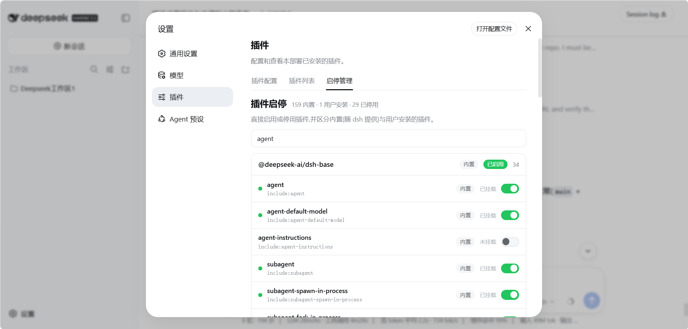

# dsh-plugin-manager

A user-installable **dsh bundle** that adds a managed enable/disable surface to
the Web **璁剧疆 鈫?鎻掍欢** page, and clearly separates **鍐呯疆鎻掍欢** (native,
shipped with the dsh installation) from **鐢ㄦ埛瀹夎** (user-installed) plugins.

It does not touch the installed dsh packages: everything lives in this bundle,
mounted through the standard profile bundle mechanism.

## What it adds

A third tab in 璁剧疆 鈫?鎻掍欢 (after 鎻掍欢閰嶇疆 / 鎻掍欢鍒楄〃):

- **鍒嗙粍娓呭崟** 鈥?every `dsh.profile.bundles` layer as a group (鍐呯疆 / 鐢ㄦ埛瀹夎
  badge on each), with its Loader rows underneath.
- **琛岀骇寮€鍏?* 鈥?toggle any loader entry. The switch writes
  `- id: <entryId>` + `disabled: true|false` into the profile's user patch
  layer (`profiles/web/cordis.patch.yml`), which the running server hot-applies:
  - Host rows take effect immediately (no restart).
  - Browser/client rows need a page refresh (they are baked into
    `window.__DSH_BOOT__` at boot).
- **鏁村寘寮€鍏?* 鈥?user-installed bundles get a bundle-level switch that toggles
  every row their own patch inserts. Native bundles are read-only at bundle
  level.
- **淇濇姢鍚嶅崟** 鈥?core rows (loader / typert / transport / storage / shell UI
  rows, including this plugin itself) refuse to be disabled.

## 鎴浘 / Screenshot

璁剧疆 鈫?鎻掍欢 椤垫柊澧炵殑銆屽惎鍋滅鐞嗐€嶆爣绛?bundle 鍒嗙粍銆佸唴缃?鐢ㄦ埛瀹夎鏍囪瘑銆佽绾т笌鏁村寘寮€鍏?:



## Install

### From git (recommended for sharing)

Recipients run (no junction, no source access needed):

```powershell
$env:DSH_HOME = '<your harness data dir>'
dsh plugin --profile web add "git+https://<repo-url>.git#v0.1.0"
```

Then **restart the web server** (`dsh web`) and refresh the browser page 鈥?the
profile composition and the browser bundle roster are read at boot.

This package has **no prepare/build script**, so pnpm never blocks its
installation behind the `allowBuilds` gate (no `pnpm-workspace.yaml` edit is
needed on the recipient side).

### From a tarball / local directory

One-time prerequisites for a source-directory (`link:`) install 鈥?the bundle's
own dependencies must be resolvable from its real location. The harness
already maintains a flat fallback (`$DSH_HOME/profiles/node_modules`, one
junction per app-closure package); link it next to the bundle so every import
resolves through the same app closure (replace `<bundle-parent-dir>` and
`<dsh-home>` with the real paths):

```powershell
New-Item -ItemType Junction -Path "<bundle-parent-dir>\node_modules" `
  -Target "<dsh-home>\profiles\node_modules"
```

```powershell
$env:DSH_HOME = '<dsh-home>'
dsh plugin --profile web add "<bundle-parent-dir>\dsh-plugin-manager"
```

(Or hand a recipient the packed tarball: `npm pack` in this directory, then
`dsh plugin --profile web add .\dsh-plugin-manager-0.1.0.tgz` 鈥?no junction
needed for the tarball path either.)

## How it works

- `cordis.patch.yml` inserts one host row `plugin-manager`, whose module is this
  package. Its default export is a Typert Remote service
  (`pluginManager.list / setRowEnabled / setBundleEnabled`).
- The api gateway claims `pluginManager/*` through **strict generated-style
  descriptors** registered by the typert-loader from `lib/typert.host.js`
  (the `./typert` export). This is the same mechanism the shipped
  plugin-inventory uses and is immune to the duplicate-module-instance hazard
  of the profile's junction layout (SRC-mode marker discovery is not relied
  on).
- `dsh.client` in `package.json` declares the browser half; `lib/client.js`
  registers the tab into the `settings.plugins.tab` slot and calls the remote
  over the generic `/api` RPC channel.
- `origin` (native vs user) is computed by two-anchor resolution: a package
  linked from the profile's own `node_modules` is user-installed; anything
  else is native to the installation.

## Files

| Path | Role |
| --- | --- |
| `cordis.patch.yml` | bundle patch: mounts the `plugin-manager` host row |
| `lib/index.js` | host half: the `pluginManager` Remote service |
| `lib/typert.host.js` | host-face typert manifest (strict wire descriptors) |
| `lib/client.js` | browser half: the managed Plugins tab |
| `package.json` | `dsh.bundle.patch` + `dsh.client` + `./typert` declarations |

## Notes / limitations

- Disabling a bundle's rows does not remove its package from
  `dsh.profile.bundles` or uninstall it 鈥?it only disables the rows (restart the
  server with the bundle still listed and it stays off; run
  `dsh plugin --profile web remove dsh-plugin-manager` to uninstall fully).
- Re-enabling a row that a lower layer (e.g. `dsh-web-app`) disabled writes an
  explicit `disabled: false` override, which is the correct patch-layer
  semantics.
- The patch file's leading comment block is preserved on writes; other comments
  are not.
- This is a local prototype of the upstream feature (enable/disable + origin in
  settings). The clean long-term home is the deepseek-harness source
  (`dsh-host-plugin-inventory` + `dsh-client-ui-settings-plugin-inventory` +
  `dsh-app-boot`).
